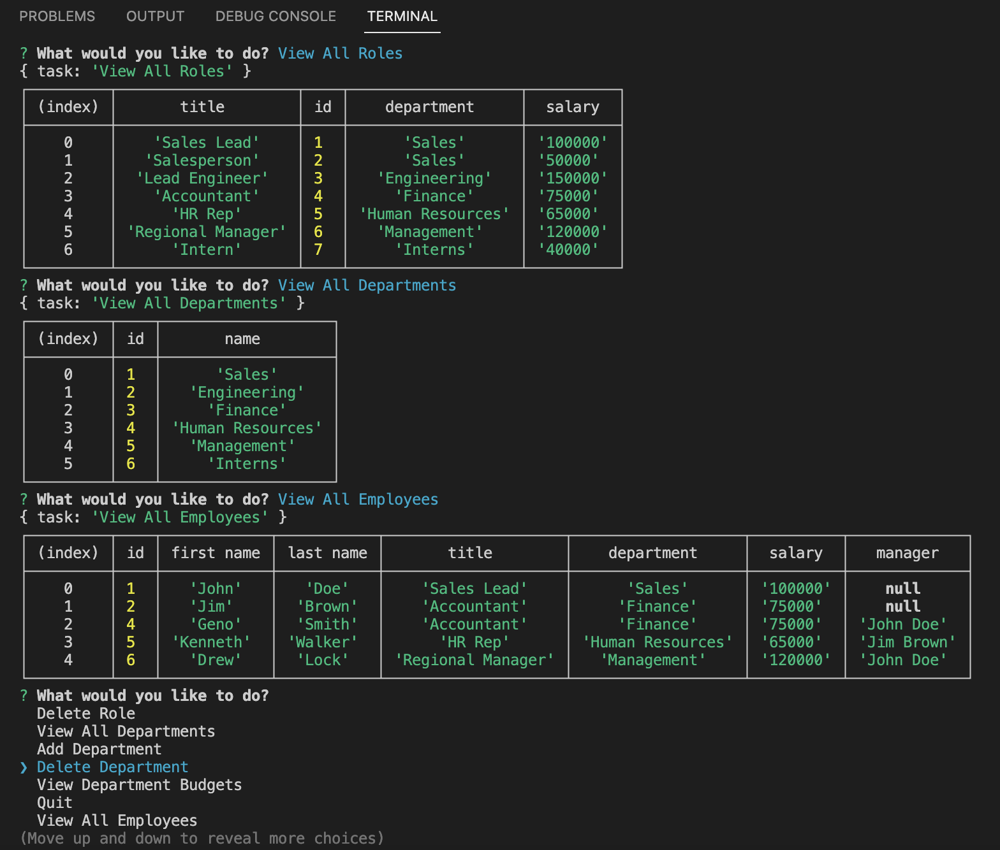

# Employee Tracker

## Description

The aim of this project was to build a command-line application to manage a company's employee database using Node.js, Inquirer, and MySQL. This application allows users to add, view, or delete departments, roles, or employees. Users are also able to update employee roles and view the total budget of different departments.

Below is an example of what the application looks like in use:



## Table of Contents

- [Installation](#installation)
- [Usage](#usage)
- [Credits](#credits)
- [License](#license)

## Installation

1. Clone the repo into your system using the following command:
```
    git clone https://github.com/noah138/employee-tracker.git
```
2. Install dependencies using the following command:
```
    npm install
```
3. Optionally, start to populate the database by directly editing the seeds.sql file.

## Usage

Run the server using the following command:
```
    node server.js
```

[Click here to watch a video demonstration](https://drive.google.com/file/d/15SfWLav4m0crHyShrdP3bPdlDxJ1jHVu/view)

## Credits

The wonderful team of instructors at the UW full-time online coding camp 2022.
